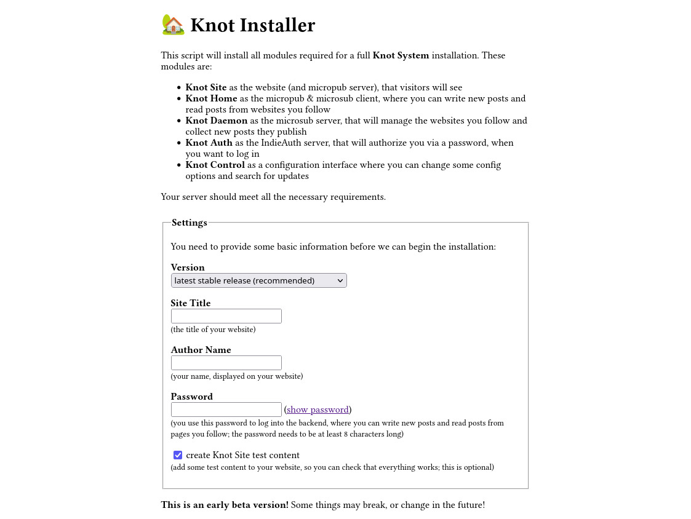

# Knot System

A small system with a personal website and a feed reader, based on the micropub, microsub and IndieAuth protocols.

Use the [Knot Installer](https://github.com/knot-system/knot-installer) to install a full system with all modules, or install individual modules directly: [Knot Site](https://github.com/knot-system/knot-site), [Knot Home](https://github.com/knot-system/knot-home), [Knot Daemon](https://github.com/knot-system/knot-daemon), [Knot Auth](https://github.com/knot-system/knot-auth) and [Knot Control](https://github.com/knot-system/knot-control)

**This is an early beta version!** Some things may break, or change in the future!

This system provides a private website with a chronological feed, a backend to write new posts and to subscribe to and read feeds of other websites and some modules that handle authentification and background activity. The modules are meant to be used together, but every piece can easily be replaced by another service that uses the [microsub](https://indieweb.org/Microsub), [micropub](https://en.wikipedia.org/wiki/Micropub_(protocol)) or [IndieAuth](https://en.wikipedia.org/wiki/IndieAuth) protocols. If you want to try it out, you can visit our [beta test page](https://d.th-nuernberg.de/knot-system/einfuehrung/) (german), or read the [setup instructions for the Knot Installer](https://github.com/knot-system/knot-installer#initial-setup).

All these prototypes are written in PHP, with human readable text files for data storage in a transparent folder structure, so no dependencies (other than PHP 8 and some additional PHP libraries) are required. They should run on any off-the-mill webhosting account. The folder structure of the content folder is inspired by the [Kirby CMS](https://getkirby.com/), which is designed to be readable by humans, so it should be very easy to move the data to another system. There is no opaque database or proprietory format, so you can always get to your data, even if this system stops working. Everything aims to be as simple and fast as possible.

The **Knot System** is a collection of smaller modules that can be used together. Every module can be replaced by an alternative, for example if you don't want to use *Knot Site* as your website, you could use a *WordPress* or *Kirby* install with a micropub-plugin as your website, and still use all the other modules that the *Knot System* provides.

The modules are the following:

## [Knot Installer](https://github.com/knot-system/knot-installer)

This is a small installer, that bundles all other modules together, so you can install and configure them in one go. Use this, if you want to install everything.

## [Knot Control](https://github.com/knot-system/knot-control)

This is used to configure and update all the other modules. You could also update all other modules manually, and use the *config.php* files to configure them, but this makes it a bit more comfortable.

## [Knot Site](https://github.com/knot-system/knot-site)

A micropub server and small website system. This can be your own website. All content can be created via textfiles in folders, or by using a micropub client (like *Knot Home*).

## [Knot Home](https://github.com/knot-system/knot-home)

A microsub and micropub client. You can connect it to your Knot Site and Knot Daemon modules It allows you to make new posts to your micropub server (Knot Site) and read all the posts from feeds you follow (Knot Daemon).

## [Knot Auth](https://github.com/knot-system/knot-auth)

A IndieAuth server, that handles authentication and token verification; it is used when you log in into Knot Home or Knot Control and verifies your authentication, when you post to Knot Site or retrieve posts from Knot Daemon.

## [Knot Daemon](https://github.com/knot-system/knot-daemon)

A microsub server that is used for following and collecting feeds. It runs in the background and collects new posts from all the feeds you follow automatically. It is not meant to be used for reading any posts, use a microsub client (like Knot Home) for that.
